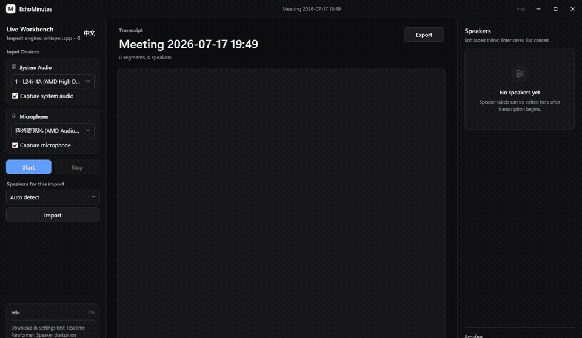
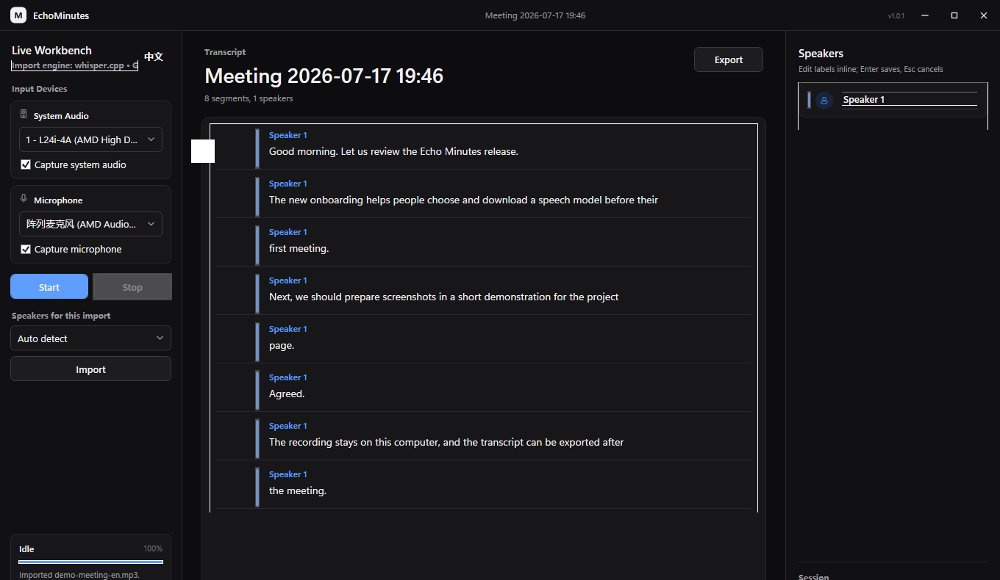
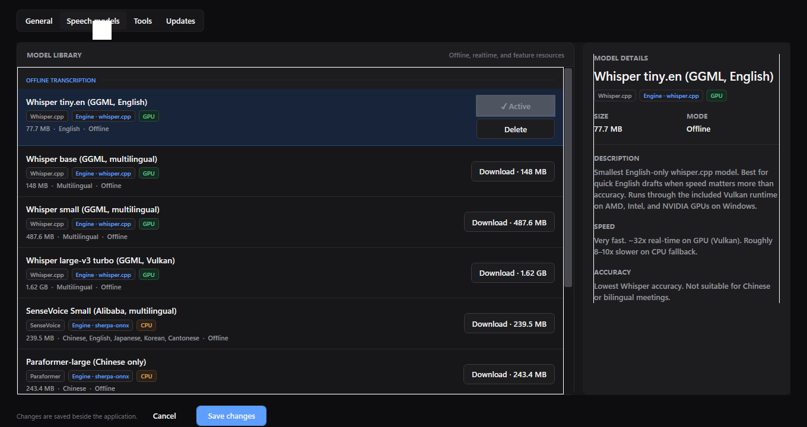

# EchoMinutes

<p align="center"><strong>本地优先的 Windows 会议录音、实时转写与离线说话人分离工具</strong></p>

<p align="center">
  <a href="https://github.com/luckykevvv/echo-minutes/releases/latest"></a>
  
  
  
</p>

<p align="center">
  <a href="https://github.com/luckykevvv/echo-minutes/releases/latest">下载最新版</a> ·
  <a href="CHANGELOG.md">更新日志</a> ·
  <a href="docs/assets/demo-meeting-en.mp3">示例音频</a>
</p>



EchoMinutes 1.1.2 支持系统音频与麦克风采集、实时中英文转写、离线媒体导入、说话人分离、可回放历史会话、转写编辑和多格式导出。音频与转写默认保存在本机；应用本身不上传会议内容，模型由用户安装后按需下载。

## 功能

- 同时或分别采集系统音频与麦克风。
- 使用设置页下载的双语 Paraformer 显示中文/英文实时转写。
- 导入 WAV、MP3、M4A、MP4、MKV、MOV 并通过 FFmpeg 转为 16 kHz 单声道 WAV。
- 支持下载并选择 whisper.cpp 模型，通过 Vulkan 加速离线转写。
- 对导入音频执行 pyannote segmentation + 3D-Speaker 聚类，自动生成 `Speaker 1`、`Speaker 2` 等标签。
- 支持指定 2–8 位说话人或自动判断，并可在界面中重命名、合并说话人。
- 提供本地会议档案，可打开、搜索、编辑或删除已保存会话。
- 保存每个会话的录音轨道；点击转写左侧时间戳即可从对应 WAV 位置播放，历史页会提示缺失录音。
- 支持直接编辑、拆分、合并和删除转写片段，并按文本或说话人搜索。
- 可选在停止录音后使用离线模型重新转写完整音轨，生成高质量最终稿。
- 一次导出 TXT、Markdown、SRT、WebVTT 和 JSON。
- 中英文界面与真实 ASR / 说话人识别进度。

## 界面预览

### 离线导入与转写

使用随仓库提供的合成会议音频，通过 Whisper tiny.en 实际导入并生成 8 个转写片段：



### 模型管理

Offline、Realtime 与功能资源在设置中分区显示；模型不会打包进安装文件：



以上演示不包含真实会议内容。可下载 [26.9 秒英文合成示例音频](docs/assets/demo-meeting-en.mp3) 自行测试导入流程。

## 系统要求

- Windows 10/11 x64。
- [.NET 8 Desktop Runtime x64](https://dotnet.microsoft.com/download/dotnet/8.0)（当前发布为 framework-dependent）。
- 实时录音需要可用的 WASAPI 播放或录音设备。
- 离线推荐模型建议使用支持 Vulkan 的 AMD、Intel 或 NVIDIA GPU；无可用 Vulkan 设备时性能会显著下降。
- 便携 ZIP 下载约 96 MiB，解压后约 253 MiB，不包含任何模型权重。首次使用必须联网下载，并为所选模型、录音和导出预留空间。

## 快速开始

1. 推荐从 GitHub Release 下载并运行 `echo-minutes-setup-x64.exe`。安装器默认安装到当前用户的 `%LocalAppData%\Programs\EchoMinutes`，不需要管理员权限，并创建开始菜单入口；若未安装 .NET 8 Desktop Runtime x64，安装器会以所选语言提示并提供官方下载入口。
2. 也可以下载便携版 `echo-minutes-win-x64.zip`，解压到当前用户可写目录后运行 `MeetingTransfer.App.exe`。
3. 首次启动会显示三步新手引导，并在程序目录旁生成 `appsettings.json` 与 `models.json`。完成或跳过后，引导不会重复弹出。
4. 在引导第二步直接选择并下载模型：离线模型下载后会自动设为默认；需要实时录音时下载 Realtime Paraformer；需要导入后自动分人时下载 Speaker diarization。以后也可从主界面左下角“设置”继续下载或切换模型。
5. 将一个已下载的 offline 模型设为默认并保存设置。
6. 实时转写：选择系统音频和/或麦克风，点击“开始”，结束时点击“停止”。
7. 离线转写：选择预计说话人数（或自动判断），点击“导入”并选择媒体文件。
8. 检查并按需编辑片段、重命名或合并说话人；点击片段左侧时间戳可回听对应录音，完成后点击“导出”。已保存记录可从“历史会话”重新打开。

长音频导入和录音后精修期间会显示“取消处理”。取消不会删除已经保存的实时稿或原始录音。

直接关闭主窗口时，应用会先停止采集、封口完整 WAV 并保存已有转写；来不及识别的排队音频块可以丢弃，但不会从录音文件中丢失。保存完成前窗口会暂时禁用。未开始录音、没有转写内容的新空白会话不会写入历史列表。

## 数据与配置

默认路径相对于应用程序所在目录（不随启动命令的当前工作目录变化）：

| 路径 | 内容 |
| --- | --- |
| `appsettings.json` | 存储、音频和 FFmpeg 配置 |
| `models.json` | 模型路径、默认离线模型和识别参数 |
| `data/meeting-transfer.sqlite` | 会话、说话人、转写段落与录音轨道引用 |
| `recordings/` | 实时录音与导入后抽取的 WAV |
| `exports/` | TXT、MD、SRT、VTT、JSON 导出 |
| `data/logs/echo-minutes.log` | 本地滚动诊断日志，不包含云端上传 |

真实配置与本地数据已由 `.gitignore` 排除。可参考 [appsettings.example.json](appsettings.example.json) 和 [models.example.json](models.example.json)。路径与模型参数也可从主界面内的“设置”页修改。

## 应用更新

EchoMinutes 启动后会异步检查 [`luckykevvv/echo-minutes`](https://github.com/luckykevvv/echo-minutes) 的最新 GitHub Release；发现新版本时，会显示版本号和 Release 更新说明。也可以在“设置 → 更新”中手动检查。每个 Release 同时提供推荐的 Windows 安装器和便携 ZIP。完整版本记录见 [CHANGELOG.md](CHANGELOG.md)；正式发布会提取对应版本的分类说明，而不是只显示提交比较链接。

确认更新后，应用会下载 `echo-minutes-win-x64.zip` 及对应的 `.sha256` 文件，校验 SHA256，安全退出，覆盖程序文件并自动重启。更新过程不会覆盖 `appsettings.json`、`models.json`、已下载模型、录音、导出或 SQLite 数据库。

维护者只需推送形如 `v1.1.2` 的 tag，GitHub Actions 会完成构建、测试、无模型权重检查，并创建 Windows x64 安装器、便携 ZIP、对应 SHA256 和自动更新说明：

```powershell
git tag v1.1.2
git push origin v1.1.2
```

## 模型与运行时

| 用途 | 推荐组件 | 后端 | 安装方式 |
| --- | --- | --- | --- |
| 实时转写 | Streaming Paraformer zh/en | sherpa-onnx CPU | 设置页下载 |
| 离线转写 | Whisper large-v3-turbo | whisper.cpp Vulkan | 设置页下载并设为默认 |
| 说话人分离 | pyannote segmentation + 3D-Speaker embedding | sherpa-onnx CPU | 设置页下载 |
| 媒体解码 | FFmpeg / ffprobe | CPU / 可用编解码后端 | 随程序提供（不是模型） |

所有模型权重均不随发布包提供。设置页提供 Whisper tiny.en、base、small、large-v3-turbo、SenseVoice Small、中文 Paraformer-large、Realtime Paraformer 和 Speaker diarization。模型从目录中的 HTTPS 上游地址下载，临时文件写为 `.part`，瞬时失败最多重试三次；目录中的每个下载文件均固定 SHA256，已有文件和新下载都会校验。官方 tar.bz2 资源只提取目录指定的单个成员。Realtime Paraformer 和 Speaker diarization 属于功能资源，不能设为离线导入默认模型。

## 已知限制

- 实时模式按音频来源标记“我方 / 远端”，尚不执行低延迟多人声纹聚类；真正的说话人分离只用于导入文件。
- 离线 ASR 与 diarization 没有共享逐词时间戳。语句跨越说话人边界时，文本按时间重叠近似切分，仍需人工复核。
- 当前捆绑的 sherpa diarizer 在此 Windows 包中使用 CPU；Vulkan 仅用于 whisper.cpp 离线转写。
- 历史会话保存的是录音文件引用而不是把 WAV 嵌入数据库；手动移动或删除 WAV 后会显示缺失提示，目前尚无图形化“重新定位文件”流程。
- 回放当前以片段时间戳和 Windows 音频输出为基础，尚无波形、逐词跟随高亮或片段级重新转写。
- 上游若替换模型文件，固定 SHA256 会拒绝新内容；此时需要先审查上游变更并更新模型目录，不能静默接受。
- 当前安装器和自动更新包尚未进行代码签名；Windows SmartScreen 可能对首次下载显示未知发布者提示。
- 正式 GUI、WASAPI 录音和更新器仍是 Windows-only；Core/STT 已通过 Linux 实机测试，完整 macOS/Linux 路线见 [跨平台路线评估](docs/cross-platform-roadmap.md)。

## 从源码构建

需要 .NET 8 SDK、Windows x64，以及已准备好的 `third_party/ffmpeg`、`third_party/sherpa-onnx`、`third_party/whisper-cpp-vulkan` 运行时二进制。发布项目只复制执行文件与运行库，不复制这些目录中的模型权重，也会从最终包移除 PDB 调试符号。构建安装器还需要 Inno Setup 6；Release 工作流会自动安装。

```powershell
dotnet restore MeetingTransfer.sln
dotnet build MeetingTransfer.sln -c Release --no-restore
dotnet test MeetingTransfer.sln -c Release --no-build
dotnet publish src/MeetingTransfer.App/MeetingTransfer.App.csproj `
  -c Release -r win-x64 --self-contained false `
  -o publish/win-x64
```

上述本地命令保留 `-dev` 版本后缀，便于视觉验收时识别构建；正式 tag 工作流会以 tag 中的版本覆盖程序集、更新器和安装器版本。

运行发布版：

```powershell
.\publish\win-x64\MeetingTransfer.App.exe
```

项目结构：

- `MeetingTransfer.Core`：转写文档、SQLite、导出、模型目录与下载。
- `MeetingTransfer.Audio`：WASAPI 采集、采样率转换与 WAV 录制。
- `MeetingTransfer.Stt`：识别引擎接口与实时串行管线。
- `MeetingTransfer.Stt.SherpaOnnx`：外部 whisper.cpp / sherpa-onnx CLI 集成。
- `MeetingTransfer.App`：WPF 界面、设置和工作流。
- `MeetingTransfer.Tests`：单元与回归测试。

## 跨平台现状

Core、SQLite、导出、模型下载、STT 接口与 CLI 调度保持 `net8.0`，当前 91 项核心测试会在 Windows、Ubuntu 与 macOS CI 验证；Windows 音频回放另由 WPF/Audio 烟雾测试覆盖。WPF、WASAPI、WaveOut、Windows 更新器和仓库携带的运行时二进制仍绑定 Windows，不能把核心测试通过解读为完整桌面支持。

推荐路线是先提供 Linux/macOS 离线 CLI 预览，再并行建设 Avalonia 客户端和平台音频后端。具体边界、运行时、打包与里程碑见 [docs/cross-platform-roadmap.md](docs/cross-platform-roadmap.md)。

## 隐私、安全与再分发

- 会议音频与转写默认只写入本地路径。首次模型下载是应用的主要网络行为。
- 模型目录只接受绝对 HTTPS 下载地址，并拒绝可能逃逸模型目录的文件名。
- 本仓库尚未声明 EchoMinutes 自有源码的公开许可证；未获得权利人许可前，不应假定源码可再分发。
- 发布包包含多项第三方运行时，但不包含模型权重。完整第三方许可文本随包位于 `Licenses/`。特别是当前 FFmpeg 构建启用了 GPLv3 选项；再分发者必须履行相应许可证与完整对应源码、构建脚本提供义务。用户另行下载的模型适用各自上游条款，详见 [THIRD_PARTY_NOTICES.md](THIRD_PARTY_NOTICES.md)。

## 发布前验证

正式构建至少应通过：Release build、全部测试、NuGet 漏洞审计、win-x64 publish、发布包模型权重为 0 的检查、应用无模型首次启动与设置页模型状态检查。下载模型后的实时/离线关键路径应另做冒烟测试。每次工作区更改与验证命令记录在 `change.md`，较早任务归档在 `change/`。

创建正式标签前，必须先在 [CHANGELOG.md](CHANGELOG.md) 中新增同版本章节，并按“新增、改进、修复、安全与发布”等类别说明用户可感知的变化。Release 工作流会拒绝缺少对应章节或分类内容的版本。
